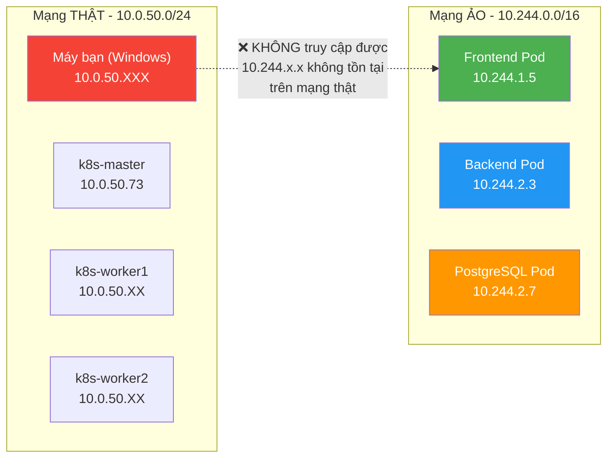
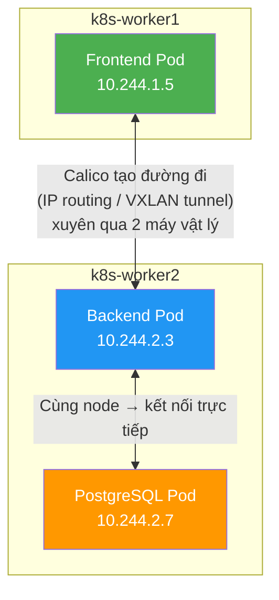
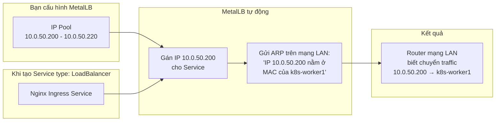
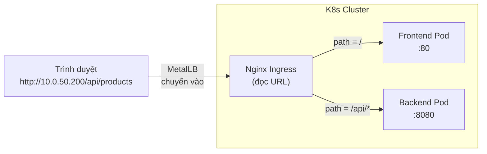

# Kubernetes Networking: Calico, MetalLB & Nginx Ingress

> Tài liệu giải thích 3 thành phần mạng cốt lõi trong K8s Bare-metal, áp dụng cho cụm cluster E-Commerce trên Rocky Linux 9.

---

## Bối cảnh: Cluster hiện tại

| Node | IP thật | Vai trò |
|---|---|---|
| `k8s-master` | `10.0.50.73` | Control Plane |
| `k8s-worker1` | `10.0.50.XX` | Worker |
| `k8s-worker2` | `10.0.50.XX` | Worker |

Ứng dụng E-Commerce gồm:
- **Frontend Pod** (React/Nginx) — port 80
- **Backend Pod** (Spring Boot) — port 8080
- **PostgreSQL Pod** — port 5432

Mỗi Pod khi khởi tạo sẽ nhận 1 IP ảo từ dải `10.244.0.0/16` (pod-network-cidr). Dải IP này **chỉ tồn tại bên trong K8s**, máy bên ngoài không truy cập được.

---

## Vấn đề gốc: 2 loại mạng tách biệt



**Câu hỏi cốt lõi:** Làm sao để máy bạn (Windows, `10.0.50.XXX`) truy cập được Frontend Pod (`10.244.1.5`)?

→ Cần 3 thành phần phối hợp: **Calico** + **MetalLB** + **Nginx Ingress**

---

## 1. Calico CNI — Mạng nội bộ giữa các Pod

### Vấn đề Calico giải quyết

Kubernetes **không tự biết** cách kết nối mạng cho Pod. Khi 2 Pod nằm trên 2 node khác nhau (ví dụ Frontend trên worker1, Backend trên worker2), chúng không thể giao tiếp với nhau trừ khi có một plugin mạng (CNI) làm cầu nối.

### Calico làm gì?



Calico thực hiện **3 chức năng**:

| Chức năng | Giải thích |
|---|---|
| **Cấp IP cho Pod (IPAM)** | Khi Pod được tạo, Calico lấy 1 IP từ dải `10.244.0.0/16` và gán cho Pod đó. Mỗi node nhận 1 subnet riêng (vd: worker1 = `10.244.1.0/24`, worker2 = `10.244.2.0/24`) |
| **Định tuyến giữa các Node** | Tạo route tables và tunnel (IP-in-IP hoặc VXLAN) để gói tin từ Pod trên worker1 có thể đi đến Pod trên worker2, dù 2 máy vật lý cách nhau |
| **Network Policy (Firewall)** | Cho phép viết luật bảo mật, ví dụ: "Chỉ Backend Pod mới được kết nối tới PostgreSQL Pod" |

### Nếu không có Calico?

```bash
kubectl get nodes
# NAME          STATUS      
# k8s-master    NotReady    ← Mãi mãi NotReady
# k8s-worker1   NotReady
# k8s-worker2   NotReady

kubectl get pods -n kube-system
# coredns-xxxx   Pending     ← Không thể cấp IP → kẹt
```

Không có Calico = không có mạng nội bộ = toàn bộ cluster **tê liệt**.

---

## 2. MetalLB — Cấp External IP trên Bare-metal

### Vấn đề MetalLB giải quyết

Sau khi có Calico, các Pod đã nói chuyện được với nhau **bên trong** K8s. Nhưng người dùng bên ngoài (trình duyệt trên máy Windows) vẫn **không thể truy cập** vào Pod vì dải `10.244.x.x` không tồn tại trên mạng LAN.

K8s cung cấp Service `type: LoadBalancer` để giải quyết việc này. **Nhưng:**

| Môi trường | Ai cấp External IP? |
|---|---|
| AWS | K8s gọi AWS API → tạo ELB → cấp Public IP |
| Google Cloud | K8s gọi GCP API → tạo Cloud LB → cấp IP |
| Azure | K8s gọi Azure API → cấp IP |
| **Bare-metal (VMs của bạn)** | **❌ Không có ai cấp!** → Service kẹt `<pending>` mãi |

### MetalLB làm gì?

MetalLB đóng vai "Cloud Provider giả lập" trên Bare-metal:



**2 bước MetalLB thực hiện:**

| Bước | Hành động | Chi tiết kỹ thuật |
|---|---|---|
| **① Gán IP** | Lấy 1 IP rảnh từ pool (`10.0.50.200`) và gán cho Service | Cập nhật field `status.loadBalancer.ingress[0].ip` của Service |
| **② Quảng bá ARP** | Thông báo trên mạng LAN rằng IP `10.0.50.200` thuộc về K8s node | Gửi Gratuitous ARP packet → Router cập nhật bảng ARP: `10.0.50.200 → MAC:xx:xx:xx` |

### Trước và sau khi có MetalLB

```bash
# TRƯỚC (không có MetalLB)
kubectl get svc -n ingress-nginx
# NAME                       TYPE           EXTERNAL-IP
# ingress-nginx-controller   LoadBalancer   <pending>      ← Kẹt mãi!

# SAU (có MetalLB, pool: 10.0.50.200-220)
kubectl get svc -n ingress-nginx
# NAME                       TYPE           EXTERNAL-IP
# ingress-nginx-controller   LoadBalancer   10.0.50.200    ← Có IP thật!
```

Từ lúc này, máy Windows của bạn đã có thể `ping 10.0.50.200` thành công. Nhưng traffic vào rồi thì **đi đâu**? → Cần Nginx Ingress phân luồng.

---

## 3. Nginx Ingress Controller — Phân luồng HTTP theo URL

### Vấn đề Nginx Ingress giải quyết

MetalLB cho bạn **1 IP duy nhất** (`10.0.50.200`). Nhưng bạn có **nhiều ứng dụng** phía sau:
- Frontend (React) — port 80
- Backend (Spring Boot API) — port 8080

Nếu không có Nginx Ingress, bạn phải:
- Cấp IP riêng cho Frontend (`10.0.50.200`)
- Cấp IP riêng cho Backend (`10.0.50.201`)
- → **Lãng phí IP**, khó quản lý khi có 10-20 services

### Nginx Ingress làm gì?

Nginx Ingress là một **Reverse Proxy** chạy bên trong K8s. Nó nhận **tất cả** traffic HTTP đi vào IP `10.0.50.200`, rồi đọc URL/domain để quyết định chuyển tiếp đến Pod nào.



### Cách cấu hình — Ingress Resource

Bạn viết 1 file YAML (Ingress rule) để khai báo luật định tuyến:

```yaml
# ingress.yml
apiVersion: networking.k8s.io/v1
kind: Ingress
metadata:
  name: shop-ingress
spec:
  ingressClassName: nginx
  rules:
    - host: shop.local                # Domain name
      http:
        paths:
          - path: /                    # Trang chủ
            pathType: Prefix
            backend:
              service:
                name: frontend-service
                port:
                  number: 80

          - path: /api                 # API endpoints
            pathType: Prefix
            backend:
              service:
                name: backend-service
                port:
                  number: 8080
```

**Kết quả:**

| Người dùng truy cập | Nginx Ingress đọc | Chuyển tiếp đến |
|---|---|---|
| `http://shop.local/` | path = `/` | → Frontend Pod (port 80) |
| `http://shop.local/products` | path = `/` (prefix match) | → Frontend Pod (port 80) |
| `http://shop.local/api/products` | path = `/api` | → Backend Pod (port 8080) |
| `http://shop.local/api/orders` | path = `/api` | → Backend Pod (port 8080) |

### Nếu có thêm ứng dụng khác?

Chỉ cần thêm rule, **không cần thêm IP**:

```yaml
rules:
  - host: shop.local        → E-Commerce app
  - host: blog.local        → Blog app
  - host: admin.local       → Admin dashboard
# Tất cả đều dùng chung 1 IP: 10.0.50.200
```

---

## Luồng traffic hoàn chỉnh (End-to-End)

Người dùng gõ `http://shop.local/api/products` vào trình duyệt:

```
┌─────────────────────────────────────────────────────────────────────┐
│                                                                     │
│  ① Trình duyệt resolve "shop.local" → 10.0.50.200                 │
│     (qua file hosts hoặc DNS)                                       │
│                         │                                           │
│                         ▼                                           │
│  ② Router mạng LAN hỏi: "10.0.50.200 ở đâu?"                     │
│     MetalLB trả lời ARP: "Ở node k8s-worker1!"                     │
│     → Traffic đi vào k8s-worker1                                    │
│                         │                                           │
│                         ▼                                           │
│  ③ kube-proxy trên worker1 nhận traffic port 80/443                │
│     → Chuyển vào Nginx Ingress Controller Pod                       │
│                         │                                           │
│                         ▼                                           │
│  ④ Nginx Ingress đọc HTTP request:                                 │
│     - Host: shop.local                                              │
│     - Path: /api/products                                           │
│     → Match rule: /api → forward tới backend-service:8080           │
│                         │                                           │
│                         ▼                                           │
│  ⑤ Calico vận chuyển gói tin:                                      │
│     Từ Nginx Pod (10.244.1.10) trên worker1                        │
│     Đến Backend Pod (10.244.2.3) trên worker2                      │
│     (qua IP routing / tunnel xuyên 2 máy vật lý)                   │
│                         │                                           │
│                         ▼                                           │
│  ⑥ Backend Pod xử lý request, query PostgreSQL,                    │
│     trả về JSON response                                            │
│     → Response đi ngược lại: Calico → Nginx → MetalLB → Trình     │
│       duyệt                                                        │
│                                                                     │
└─────────────────────────────────────────────────────────────────────┘
```

---

## Bảng tổng kết

### 3 thành phần — 3 tầng khác nhau

| | Calico CNI | MetalLB | Nginx Ingress |
|---|---|---|---|
| **Làm gì** | Kết nối Pod ↔ Pod bên trong cluster | Cấp External IP thật cho Service | Phân luồng HTTP theo URL/domain |
| **Tầng mạng** | Layer 3 (IP routing) | Layer 2/4 (ARP + TCP) | Layer 7 (HTTP/HTTPS) |
| **Phạm vi** | Nội bộ cluster | Cửa ngõ vào cluster | Bộ định tuyến HTTP |
| **Bắt buộc?** | ✅ Luôn luôn | ✅ Trên Bare-metal | ⚠️ Có thể thay bằng NodePort (nhưng không nên) |
| **Thay thế bởi** | Flannel, Cilium, Weave | Cloud LB (trên AWS/GCP) | Traefik, HAProxy Ingress |
| **Cài khi nào** | Ngay sau `kubeadm init` | Sau khi cluster Ready | Sau MetalLB |

### Nếu thiếu 1 thành phần?

| Thiếu gì | Hậu quả |
|---|---|
| **Thiếu Calico** | Nodes = `NotReady`, CoreDNS = `Pending`, Pod không có IP, cluster tê liệt hoàn toàn |
| **Thiếu MetalLB** | Pod hoạt động bình thường bên trong, nhưng bên ngoài **không truy cập được** (Service kẹt `<pending>`) |
| **Thiếu Nginx Ingress** | Vẫn truy cập được bằng NodePort (`http://10.0.50.73:30080`), nhưng không phân luồng URL được, mỗi service cần 1 port riêng, không có SSL termination |
